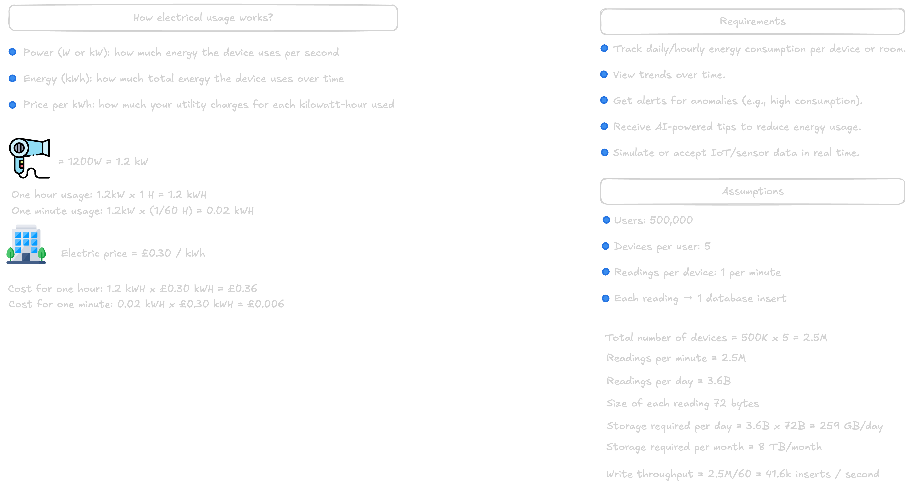
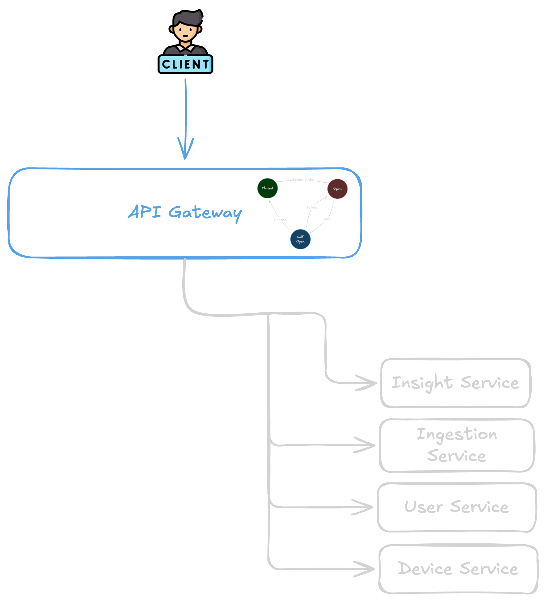
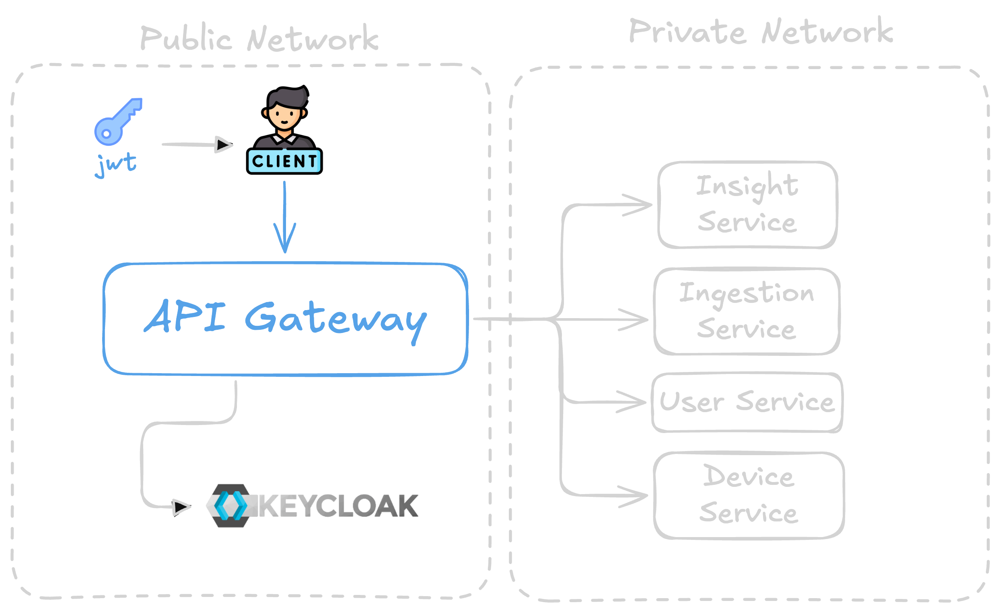
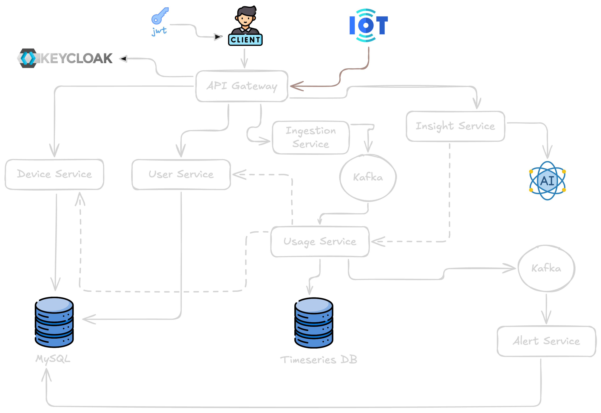
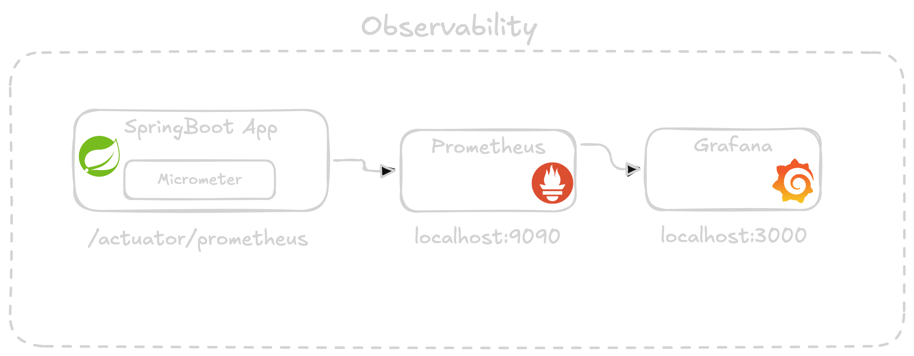

# Home Energy Tracker

[](https://openjdk.org/)
[](https://spring.io/projects/spring-boot)
[](https://spring.io/projects/spring-cloud)
[](https://docs.docker.com/compose/)
[](https://opentelemetry.io/)
[](https://grafana.com/docs/k6/latest/)

A **microservices reference implementation** for monitoring and reasoning about household electricity usage. The system accepts energy readings from devices, processes them asynchronously, stores time-series metrics, raises alerts when usage spikes, and exposes a unified API through an **API Gateway** with **resilience**, **security**, and **observability** built in.

---

## Project overview

**Home Energy Tracker** models how a real product might collect **power (watts)** and **timestamps** from smart plugs or meters, aggregate that data for dashboards and billing-style views, and notify residents when consumption crosses thresholds.

**Problem it solves:** Raw device events are high-volume and need reliable ingestion, decoupled processing, and specialized storage (relational metadata vs. time-series measurements). This project demonstrates that split: HTTP APIs for users and devices, Kafka for event streaming, InfluxDB for usage series, and MySQL for durable domain data.

**Typical use cases:**

- Track **per-device** energy usage over time  
- **Alert** when instantaneous or aggregated power exceeds a limit  
- **Gate** all public HTTP traffic through one entry point (API Gateway) with JWT validation  
- **Observe** latency, errors and circuit-breaker state with Prometheus and Grafana, and follow a single request across services with distributed traces and correlated logs  
- **Protect** the services with per-client rate limits and keep slow LLM answers in a cache  
- **Measure** how the system behaves under load with repeatable k6 scenarios  

---

## Architecture overview

The system is a **microservices architecture** built with **Spring Boot 4.1.1** and **Java 21**. Services are independently deployable modules; integration uses **synchronous HTTP** (client → gateway → service) and **asynchronous messaging** (Kafka) where loose coupling and scale matter.

**Patterns and capabilities:**

| Area | Approach |
|------|----------|
| **API Gateway** | Spring Cloud Gateway (Server MVC); single public HTTP façade, route aggregation, OpenAPI aggregation |
| **Service communication** | REST between gateway and backends; Kafka for ingestion → usage → alerts |
| **Resilience** | **Circuit breakers** (Resilience4j) on gateway routes with fallbacks |
| **Rate limiting** | Per-client **token buckets** (Bucket4j) at the gateway, stored in **Redis** and shared by every instance |
| **Caching** | **Redis** cache for the LLM answers of `insight-service`, one Ollama call per user even under concurrent requests |
| **Security** | **OAuth2 Resource Server** on the gateway; **Keycloak** for identity (dev profile in Docker Compose) |
| **Observability** | **Metrics** (Micrometer → Prometheus), **traces** and **logs** (OpenTelemetry → Tempo and Loki), all linked in **Grafana** |
| **Load testing** | **k6** scenarios (smoke, load, stress, spike) with results pushed to Prometheus |
| **Configuration** | Per-service `application.yaml` with `${ENV:default}` overrides (no Spring Cloud Config Server in this repo) |

**High-level interaction:** Clients call the **API Gateway**. Domain services (**user**, **device**, **ingestion**, **insight**) sit behind it. **Ingestion** publishes to Kafka; **usage** consumes, writes to **InfluxDB**, and may publish **alerts**; **alert** consumes alerts and sends email (e.g. via **Mailpit** in local dev). **Insight** can provide AI-style summaries (Spring AI), routed through the gateway when enabled.

---

## Services breakdown

| Service | Port | Responsibility | Key technologies | Interactions |
|---------|------|------------------|------------------|--------------|
| **api-gateway** | `9000` | Public entry: routing, circuit breaking, rate limiting, JWT validation, aggregated API docs | Spring Boot 4, Spring Cloud Gateway (WebMVC), Resilience4j, Bucket4j, OAuth2 Resource Server, springdoc | Proxies to user, device, ingestion, usage, insight services; calls Keycloak JWKS; rate-limit buckets in Redis |
| **user-service** | `8081` | User accounts and related persistence | Spring Boot 4, JPA, MySQL, Flyway, Actuator/Prometheus | MySQL; invoked via gateway |
| **device-service** | `8082` | Device registry / metadata | Spring Boot 4, JPA, MySQL, Actuator/Prometheus | MySQL; invoked via gateway |
| **ingestion-service** | `8083` | Accept energy readings over HTTP and publish to streaming pipeline | Spring Boot 4, Kafka producer, Actuator/Prometheus | Produces to Kafka (`energy-usage`); invoked via gateway or directly for tests |
| **usage-service** | `8084` | Consume usage events, time-series storage, aggregation / threshold logic | Spring Boot 4, Kafka consumer/producer, InfluxDB Java client, Actuator/Prometheus | Kafka ↔ InfluxDB; produces alert events for downstream consumers |
| **alert-service** | `8085` | Consume alert events, notify users (e.g. email) | Spring Boot 4, Kafka, JPA, Mail, MySQL, Actuator/Prometheus | Kafka consumer; SMTP (Mailpit locally); MySQL where applicable |
| **insight-service** | `8086` | Usage insights (e.g. LLM-backed explanations via Ollama) | Spring Boot 4, Spring AI, Ollama starter, Redis cache, Actuator/Prometheus | Invoked via gateway; calls usage-service and an external Ollama runtime; answers cached in Redis |

> **Note:** All services target **Spring Boot 4.1.1** and export metrics, traces and logs; `insight-service` uses **Spring AI** for model integration. There is **no** Spring Cloud Config Server or Kubernetes manifests in this repository—Compose is the primary local orchestration path.

---

## System flow and diagrams

### Background and requirements

*Electricity basics, assumptions, and what the system must support (sources, units, constraints).*

  
*Figure: Background and requirements for the Home Energy Tracker domain.*

---

### Circuit breaker in the API Gateway

*When downstream services fail or slow down, the gateway stops hammering them: the **circuit breaker** opens, short-circuits calls, and can return a controlled fallback—improving stability for the whole system.*

  
*Figure: Resilience and circuit breaker behavior at the edge (API Gateway).*

---

### Gateway in the public network

*The **API Gateway** sits in a **public** or DMZ-style network segment while core services run in a more **private** zone. Clients never talk to every microservice directly; they use one controlled entry point.*

  
*Figure: Public vs private network separation with the gateway as the controlled entry point.*

---

### Full microservices flow

*End-to-end path: ingestion, messaging, usage processing, storage, alerting, and supporting services.*

  
*Figure: Full system walkthrough across components and data paths.*

---

### Observability with Prometheus and Grafana

*Services expose **Prometheus**-compatible metrics via Actuator. **Prometheus** scrapes and stores series; **Grafana** visualizes SLO-friendly dashboards (latency, errors, JVM, circuit breaker health).*

  
*Figure: Monitoring and observability stack (metrics flow and tooling).*

---

## Tech stack

- **Language:** Java **21**  
- **Framework:** **Spring Boot 4.1.1** (all services and gateway); **Spring AI** (`insight-service`)  
- **Spring Cloud:** **2025.1.3** — Gateway (Server WebMVC), **Circuit Breaker** (Resilience4j)  
- **Messaging:** **Apache Kafka** (KRaft)  
- **Databases:** **MySQL 8** (relational data), **InfluxDB 2** (time-series usage), **Redis 8** (cache and rate-limit buckets)  
- **Rate limiting:** **Bucket4j** (token buckets over Redis)  
- **Identity (local dev):** **Keycloak**  
- **Email (local dev):** **Mailpit**  
- **Observability:** **Micrometer**, **Prometheus**, **OpenTelemetry**, **Grafana Tempo** (traces), **Grafana Loki** (logs), **Grafana**  
- **Load testing:** **k6** (runs in Docker)  
- **API documentation:** **springdoc-openapi** (gateway aggregates service OpenAPI URLs)  
- **Containerization:** **Docker** & **Docker Compose**  
- **Build:** **Maven** (each service includes `mvnw`)  

Kubernetes is **not** part of this repo; deploying to K8s would be a natural extension (Helm charts, ConfigMaps, service mesh, etc.).

---

## Getting started

### Prerequisites

- **JDK 21**  
- **Docker** and **Docker Compose**  
- **Maven** (optional if you use `./mvnw` in each service)  

### Clone the repository

```bash
git clone git@github.com:dev-danilocordeiro/energy-tracker.git
cd energy-tracker
```

### Start infrastructure

From the **repository root**:

```bash
cp .env.example .env    # first time only: ports, credentials, the Keycloak client secret
docker compose up -d
```

This brings up **MySQL**, **Kafka**, **Kafka UI**, **InfluxDB**, **Mailpit**, **Keycloak** (+ DB), **Redis**, **Prometheus**, **Grafana**, **Tempo** and **Loki**. The **k6** service is not started: it only runs on demand (see [Load testing](#load-testing-k6)).

Stop everything:

```bash
docker compose down
```

If databases fail to initialize, remove volumes.

### Build services

Each microservice is its own Maven project:

```bash
cd user-service && ./mvnw -q package && cd ..
# Repeat for: device-service, ingestion-service, usage-service, alert-service, insight-service, api-gateway
```

Or run with:

```bash
./mvnw spring-boot:run
```

### Run applications

1. Ensure Docker Compose is running (Kafka, MySQL, InfluxDB, etc.).  
2. Start services on the **host** on their default ports (see table above)—or containerize them yourself.  
3. For **Kafka from the host**, bootstrap is typically **`localhost:9092`** (external listener in Compose).  

**Prometheus** in this repo is configured to scrape **`host.docker.internal`** for Actuator endpoints—so metrics work when Spring Boot apps run on the **host** while Prometheus runs in Docker. The apps push traces and logs to Tempo (`localhost:4318`) and Loki (`localhost:3100`) on their own.

`ingestion-service` ships a data simulator that posts ~200 readings/s. Start it with `SIMULATION_ENABLED=false` when you want quiet logs or a clean load test.

### Quick pipeline test

Post a sample reading to ingestion (direct to service or via gateway if routed):

```bash
curl -X POST http://localhost:8083/api/v1/ingestion \
  -H 'Content-Type: application/json' \
  -d '{"deviceId":1,"energyConsumed":1.25,"timestamp":"2025-01-01T12:00:00Z"}'
```

Then check **usage-service** logs, **InfluxDB**, **Kafka UI** (`http://localhost:8090`), and **Mailpit** (`http://localhost:8025`) after threshold/alert logic runs.

### Access points (local defaults)

| What | URL |
|------|-----|
| **API Gateway** | http://localhost:9000 |
| **Grafana** | http://localhost:3000 (admin / admin) |
| **Prometheus** | http://localhost:9090 |
| **Kafka UI** | http://localhost:8090 |
| **Mailpit** | http://localhost:8025 |
| **Keycloak** | http://localhost:8091 |
| **InfluxDB UI** | http://localhost:8072 |
| **Traces** (Tempo, through Grafana) | http://localhost:3000/a/grafana-exploretraces-app/explore |
| **Logs** (Loki, through Grafana) | http://localhost:3000/a/grafana-lokiexplore-app/explore |
| **k6 live dashboard** (while a test runs) | http://localhost:5665 |
| **Redis** | `localhost:6379` (`docker exec -it energy-tracker-redis redis-cli`) |

Service-specific OpenAPI is linked from the gateway’s Swagger UI configuration (`/swagger-ui.html`).

---

## Observability

Three signals, all opened from **Grafana** (http://localhost:3000, `admin` / `admin`) and linked to each other.

| Signal | How it gets there | Where to look |
|--------|-------------------|---------------|
| **Metrics** | Each app exposes `/actuator/prometheus`; Prometheus scrapes it (`docker/prometheus/prometheus.yml`) | Dashboards below, or Explore → Prometheus |
| **Traces** | OpenTelemetry (`spring-boot-starter-opentelemetry`) exports spans over OTLP to **Tempo** | *Drilldown → Traces*, or Explore → Tempo |
| **Logs** | The OpenTelemetry Logback appender ships every log line to **Loki** with its `trace_id` | *Drilldown → Logs*, or Explore → Loki |

**Following a request.** A request gets a single trace from the gateway through the service it calls, across Kafka and into the consumers, for example:

```
api-gateway        SERVER    POST /api/v1/ingestion/**
api-gateway        CLIENT    http post
ingestion-service  SERVER    POST /api/v1/ingestion
ingestion-service  PRODUCER  energy-usage send
usage-service      CONSUMER  energy-usage process
```

From a span, **Logs for this span** opens the matching lines in Loki. From a log line, **Open trace** goes back. On the latency panels, the dots are **exemplars**: sampled requests that link straight to their trace.

**Dashboards** (provisioned from `docker/grafana/provisioning`, folder *Home Energy Tracker*):

- **Services Overview**: status and uptime, HTTP throughput, 5xx ratio, p95 latency with exemplars, JVM, HikariCP pool, rate-limit decisions, and insight cache hit ratio.
- **Home Energy Tracker - Overview**: request rate by service and status code, 4xx and 5xx rates, scrape target health, heap, and top endpoints.
- **k6 Load Tests**: the results of each load test run, next to the services' own metrics for the same window.

Sampling is 100% by default (`TRACING_SAMPLING_PROBABILITY`). Tempo keeps traces for 24h and Loki keeps logs for 7 days.

---

## Caching

`insight-service` asks a local LLM (Ollama) for saving tips and overviews. Each answer takes seconds, so answers are cached in **Redis** per user for `INSIGHT_CACHE_TTL` (1h by default).

| Case | Without cache | With cache |
|------|---------------|------------|
| Same user asks again | ~8s (Ollama) | ~15ms (Redis) |
| 5 concurrent requests for the same user, cold cache | 5 Ollama calls | 1 Ollama call, all 5 wait for it |

- Keys look like `insight:saving-tips::<userId>` and `insight:overview::<userId>`, stored as JSON. To force a fresh answer: `docker exec energy-tracker-redis redis-cli del insight:saving-tips::42`.
- If Redis is down, requests still work: they go straight to Ollama and log a warning.
- Users without devices are never cached, so a user who registers a first device gets real tips right away.
- CRUD endpoints are deliberately not cached: the k6 baseline has them at 7–23ms p95, so there is little to gain and invalidation to get wrong.

---

## Rate limiting

The gateway limits each **client** (the `sub` of its JWT) with token buckets stored in **Redis**, so every gateway instance enforces the same limits.

| Policy | Routes | Limit |
|--------|--------|-------|
| `default` | user, device, ingestion, usage | bursts of 100, then 50 req/s |
| `insight` | insight | 10 per minute (each cache miss is an LLM call) |

- Every limited response carries `X-RateLimit-Limit` and `X-RateLimit-Remaining`.
- Over the limit, the gateway answers **429** with a `ProblemDetail` body and `Retry-After` (in seconds), without calling the service.
- If Redis is unreachable, the gateway lets traffic through unlimited and logs a warning, instead of failing requests.
- Limits are set with `RATE_LIMIT_DEFAULT_CAPACITY`, `RATE_LIMIT_DEFAULT_REFILL`, `RATE_LIMIT_INSIGHT_CAPACITY` and `RATE_LIMIT_INSIGHT_REFILL`. `RATE_LIMIT_ENABLED=false` turns the limiter off.

---

## Load testing (k6)

[k6](https://grafana.com/docs/k6/latest/) scenarios in [`load-tests/`](load-tests/) drive the API through the gateway the way a client would: Keycloak token, JWT on every request, a weighted mix of reads, writes and energy readings. k6 runs in Docker, so there is nothing to install.

**Before running:** start the compose stack and all services, and make sure `HET_CLIENT_SECRET` is set in `.env`. For a clean measurement, start `ingestion-service` with `SIMULATION_ENABLED=false`.

```bash
load-tests/run.sh smoke     # 2 VUs for 30s: does everything answer?
load-tests/run.sh load      # ramp to 20 VUs, hold 3 min: the baseline
load-tests/run.sh stress    # step up to 200 VUs: where does it break?
load-tests/run.sh spike     # 5 → 150 VUs in 10s and back: does it recover?
```

Scenarios are tuned with environment variables, and extra arguments go straight to `k6 run`:

```bash
VUS=50 HOLD=10m load-tests/run.sh load
PEAK_VUS=400 load-tests/run.sh stress
INCLUDE_INSIGHT=true load-tests/run.sh load    # also call insight (Ollama), off by default
load-tests/run.sh load --vus 5                 # any k6 flag
```

| Variable | Default | Scenario |
|----------|---------|----------|
| `VUS` / `HOLD` | `20` / `3m` | load |
| `PEAK_VUS` | `200` | stress |
| `SPIKE_VUS` | `150` | spike |
| `POOL_SIZE` / `DEVICES_PER_USER` | `20` / `2` | all (test data) |
| `INCLUDE_INSIGHT` | `false` | all |
| `GATEWAY_URL` | `http://localhost:9000` | all |

**Reading the results:**

- **Grafana → k6 Load Tests**: pick the run in *Test run* (each run gets an id like `load-20260928-000729`). You get VUs vs throughput, status codes, p95/p99 per endpoint and where the time goes, plus the services' own latency, CPU, heap and connection pool for the same window.
- **Live dashboard** at http://localhost:5665 while the test runs.
- **HTML report** in `load-tests/reports/<scenario>-<timestamp>.html`.
- The **terminal summary**. The command exits with code `99` when a threshold is crossed: more than 1% failed requests, p95 above 500ms, or fewer than 99% of checks passing.

Test users and devices are created before the run and deleted after it, so the database is left as it was. Interrupting a run with Ctrl+C skips that cleanup.

**Baseline** (`load`, 20 VUs for 4m30s): 4,853 requests, 0% failed, overall p95 of 11ms. The slowest endpoint was `GET /usage/{userId}` at 22ms p95.

> **Rate limiting applies to k6 too.** All VUs share one token, so k6 counts as a single client. `load` stays well under the limit, but `stress` and `spike` will get 429s once they pass ~50 req/s: that is the limiter doing its job. To stress the services themselves, start the gateway with `RATE_LIMIT_ENABLED=false`.

More detail in [`load-tests/README.md`](load-tests/README.md).

---

## Future improvements

- **End-to-end tests** — Contract or black-box tests across gateway → services → Kafka → DB  
- **CI/CD** — Build matrix per service, image publish, Compose or K8s smoke tests  
- **Frontend dashboard** — SPA for devices, live usage charts, alert history  
- **AuthZ hardening** — Fine-grained scopes, service-to-service tokens, policy engine  
- **Kubernetes** — Helm charts, external secrets, HPA, and Kafka/Influx operators  
- **Centralized config** — Spring Cloud Config or external secret stores for non-dev environments  

---

## Additional documentation

- [`AGENTS.md`](AGENTS.md): conventions, commands and gotchas for working on the code.  
- [`load-tests/README.md`](load-tests/README.md): how the k6 scenarios work.  
- [`bruno/`](bruno/): the API collection for manual and end-to-end checks.  

---

*Home Energy Tracker — a portfolio-grade Spring microservices example for learning production-style patterns without oversimplifying the moving parts.*
